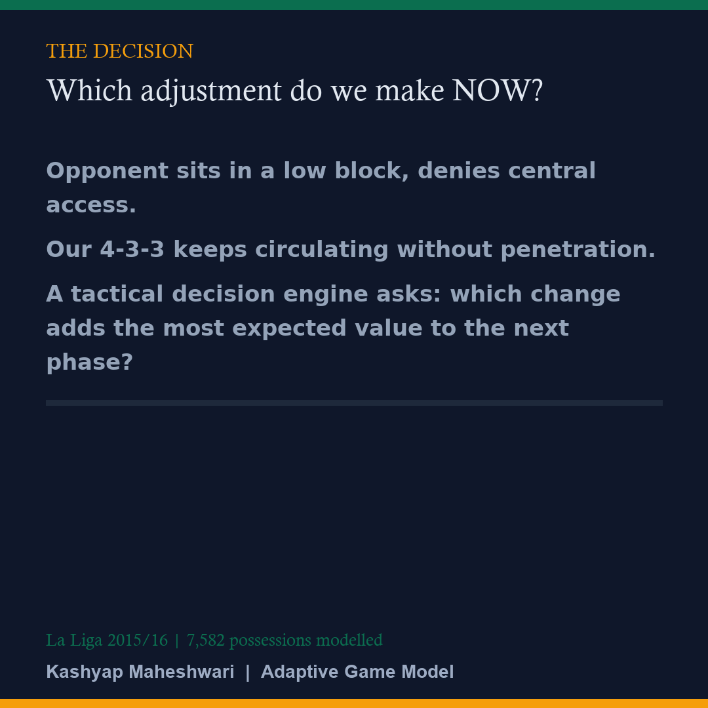
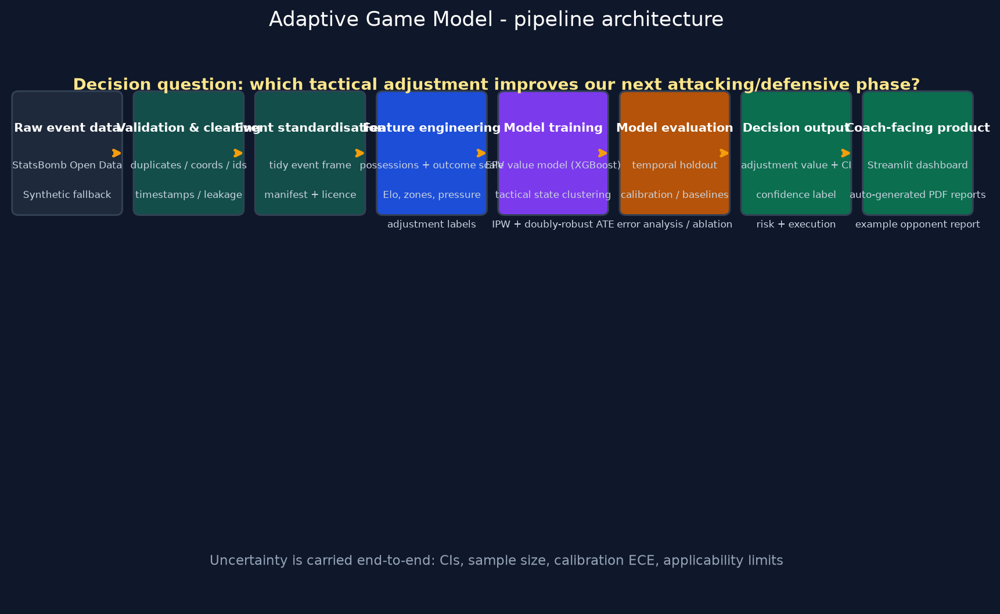

# Adaptive Game Model

**A Context-Aware Tactical Adjustment Engine for Football**

> "Given the opponent's structure and our current game model, which tactical adjustment is most likely to improve our next attacking or defensive phase?"



---

## What problem does this solve?

Most football analytics projects *describe* formations or *predict* winners. This project models tactical adaptation as a **decision problem**: it detects recurring tactical states in match events and estimates the **counterfactual value** of alternative tactical responses — with explicit uncertainty — so a coach can answer *"what should we change?"* before the next phase, not "who will win?"

It is an **event-based tactical decision model, not a complete tracking-data system** — that scope statement is deliberate, and it keeps the system reproducible on public data.

## Who would use it?

- **Coaches / assistant coaches** — pre-match and in-match adjustment support.
- **Analysts** — opponent profiling and "what-if" scenario exploration.
- **Sporting directors / heads of recruitment** — evidence-based decisions about how a squad can adapt.
- **Anyone evaluating an analyst** — this repository demonstrates the full craft: data engineering, causal inference, calibration, uncertainty, executive communication, and deployment.

## What data does it use?

- **StatsBomb Open Data** (CC BY-NC-SA 4.0) — La Liga 2015/16, 40 matches from Barcelona / Real Madrid / Atlético Madrid fixtures. Messi-era elite football.
- A **deterministic synthetic generator** with the identical schema keeps the pipeline runnable offline and in CI.
- No tracking data. Event data only. (That is a feature: it is honest and reproducible.)

## What is the key result?

- A **possession value model** (XGBoost + isotonic calibration) that beats every baseline **out-of-time** (train on earlier matches, test on future matches — never random splits).
- **8 named tactical states** (opponent low block, high press, wide overload, defensive transition, ...) discovered by clustering and labelled with football prototypes — never "Cluster 7".
- **Causal adjustment values**: for each state × adjustment pair, a doubly-robust ATE with a 95% match-clustered bootstrap confidence interval, sample size, risk, execution requirement, and a `high / medium / low` confidence label.

Example output (coach-facing, uncertainty-first):

> "Against **opponent low block**, adopting **attack the far-side half-space** historically created **+0.018 expected possession value per possession** (95% CI [+0.002, +0.034]) with **medium confidence**, based on 47 comparable sequences."

## Why is it different?

| Typical project | This project |
|---|---|
| Predicts goals / winner | Estimates *which adjustment to make next* |
| Reports "Cluster 7" | Names states in coaching language |
| Naive averages | IPW + doubly-robust causal estimates |
| Random train/test splits | **Chronological, match-level, leakage-checked** |
| One headline accuracy number | Calibration ECE, error analysis, ablation, sensitivity |
| Static notebook | Live Streamlit dashboard + auto-generated PDFs |
| No humans | Human-in-the-loop (analyst comments, scout override, coach feedback) |

---

## Repository layout

```
project/
├── README.md                  <- this file
├── LICENSE                    <- MIT for code + StatsBomb data license note
├── pyproject.toml             <- CI-ready packaging + ruff + pytest config
├── requirements.txt
├── Dockerfile                 <- containerised Streamlit app
├── .pre-commit-config.yaml
├── .github/workflows/ci.yml   <- lint + tests + pipeline smoke + reports + docker
├── data/
│   ├── raw/statsbomb/         <- downloaded event data + manifest + licenses
│   └── processed/             <- all pipeline artefacts (models, reports, outputs)
├── docs/                      <- methodology, data dictionary, model card, social kit
├── src/
│   ├── config.py              <- single source of truth: tactical vocabulary
│   ├── ingestion/             <- download + StatsBomb loader + manifest
│   ├── synthetic/             <- deterministic offline generator
│   ├── validation/            <- automated data-quality checks + gate
│   ├── features/              <- events, possessions, Elo, strategy labels
│   ├── models/                <- value model, calibration, states, adjustments
│   ├── evaluation/            <- temporal split, metrics, error analysis, ablation
│   ├── decision/              <- recommendation engine + coach-facing text
│   ├── visualisation/         <- pitch plots, cards, architecture diagram
│   ├── reporting/             <- PDF reports (technical / coach / recruitment)
│   └── pipeline/              <- end-to-end orchestration
├── app/                       <- Streamlit dashboard (5 pages)
├── reports/                   <- auto-generated PDFs
├── visuals/                   <- architecture diagram, cards, calibration, demo.gif
├── scripts/                   <- download_data / generate_reports / generate_visuals
├── notebooks/                 <- exploration notebooks
└── tests/                     <- pytest suite
```

## Pipeline

```
raw data -> validation -> cleaning -> event standardisation
   -> feature engineering -> model training -> model evaluation
   -> decision output -> dashboard / reports
```



## Installation

> **New here? Read [`docs/GETTING_STARTED.md`](docs/GETTING_STARTED.md) first** —
> a plain-language guide for analysts/coaches with what to download, what to
> install, and how to run everything in ~15 minutes. Deployment details are in
> [`docs/DEPLOYMENT.md`](docs/DEPLOYMENT.md).
>
> **Evaluating this project?** Data, results, and how they were produced:
> [`docs/DATA_PROVENANCE.md`](docs/DATA_PROVENANCE.md). What it does, doesn't do,
> and who should use it: [`docs/PROJECT_SCOPE.md`](docs/PROJECT_SCOPE.md).

```bash
# 1. Clone / unzip
git clone https://github.com/your-handle/adaptive-game-model.git
cd adaptive-game-model

# 2. Environment (Python 3.10-3.12 recommended)
python -m venv .venv
source .venv/bin/activate        # Windows: .venv\Scripts\activate
pip install -r requirements.txt

# 3. (Optional) real data - 40 La Liga 2015/16 elite matches
python scripts/download_data.py

# 4. Run the full pipeline (auto-falls back to synthetic data offline)
python -m src.pipeline.run_all

# 5. Dashboard
streamlit run app/Home.py

# 6. Reports + visuals
python scripts/generate_reports.py
python scripts/generate_visuals.py

# 7. Tests + lint
pytest
ruff check src app tests scripts
```

## Reproducible commands

```bash
python -m src.pipeline.run_all            # full run, real data if available
python -m src.pipeline.run_all --synthetic --quick   # CI smoke (deterministic)
python -m src.pipeline.run_all --competition 11 --season 27   # other leagues
docker build -t adaptive-game-model .     # containerised dashboard
docker run -p 8501:8501 adaptive-game-model
```

## Demo and deployment

The current public demo is linked in the Contact section below. The application
is a standard Streamlit multi-page app, so the same repository can be deployed
to Streamlit Community Cloud, Hugging Face Spaces, or a Docker host without
changing the modelling code. See [`docs/DEPLOYMENT.md`](docs/DEPLOYMENT.md) for
the platform-specific steps and the checks I run before publishing.

The repository includes `pyproject.toml`, `requirements.txt`, `Dockerfile`,
`.streamlit/config.toml`, and pre-computed `data/processed` artefacts so a
deployed dashboard can render immediately before a fresh pipeline run.

## My engineering decisions

This is a decision-support prototype, so I prioritised a defensible football
ontology, chronological validation, calibration, uncertainty, and readable
coach-facing outputs over a larger or less interpretable model. The reasoning
behind those choices is documented in
[`docs/DESIGN_DECISIONS.md`](docs/DESIGN_DECISIONS.md).

## Validation summary (honest numbers)

- **Chronological split**: train on earlier matches, validate & test on later matches. Leakage check confirms no match appears in two splits.
- **Baselines**: XGBoost+calibration beats league average, linear regression, Elo-only and dummy regressors out-of-time (see `data/processed/evaluation_report.json`).
- **Calibration**: ECE reported on the test set; isotonic calibration fit on the validation set only.
- **Error analysis**: 3 best and 3 worst predictions with explanations and the data that would improve them.
- **Ablation**: full features vs no-Elo / no-match-context / no-location.
- **Sensitivity**: recommendation stability under match-drop (does it over-recommend dominant teams?).

## Data licensing

- Code: **MIT** (see `LICENSE`).
- Data: **StatsBomb Open Data — CC BY-NC-SA 4.0**. Attribute StatsBomb; non-commercial only. See `data/raw/statsbomb/LICENSE.txt`.

## Model limitations (never hidden)

1. Event-based — no tracking data (space, timing, off-ball movement absent).
2. Strategy labels are transparent rule-based proxies of coaching concepts.
3. Estimates are historical expectations with explicit uncertainty, not guarantees.
4. Applicability limited to opponents/leagues represented in the training set.
5. Small samples produce low-confidence recommendations by design.

## Deliverables in this repository

- [ ] Full architecture diagram — `visuals/architecture_diagram.png`
- [ ] Production-grade Python: `pyproject.toml`, `Dockerfile`, CI, tests
- [ ] Auto-generated PDFs — `reports/technical_report.pdf`, `reports/coach_report.pdf`, `reports/recruitment_report.pdf`, `reports/opponent_report.pdf`
- [ ] Data dictionary — `docs/data_dictionary.md`
- [ ] Model card — `docs/model_card.md` (+ JSON)
- [ ] Methodology paper — `docs/methodology.md`
- [ ] Tactical-state methodology — `src/models/tactical_states.py` + methodology doc
- [ ] Example opponent report — `reports/opponent_report.pdf`
- [ ] Social media kit (5-card carousel + posting guide) — `docs/social_kit.md`, `visuals/cards/`
- [ ] Demo GIF — `visuals/demo.gif`
- [ ] README with problem statement, novelty verification, club-ready deployment notes
- [ ] [Design decisions and module walkthrough](docs/DESIGN_DECISIONS.md)

## Contact

**Kashyap Maheshwari** — [Kashyap.maheshwari3@gmail.com](mailto:Kashyap.maheshwari3@gmail.com)  
[LinkedIn](https://www.linkedin.com/in/kashyap-maheshwari-02469b85/) · [X](https://www.x.com/AbhisheK2M96) · [Live dashboard](https://football-project-1-u1bbf3e.verdent.app)  

**Project repository:** [github.com/kashyapmaheshwari3-collab/adaptive-game-model](https://github.com/kashyapmaheshwari3-collab/adaptive-game-model)

_Positioning: I build decision-intelligence systems for football — event data to counterfactual adjustment value, with the uncertainty a coaching staff can actually trust._
